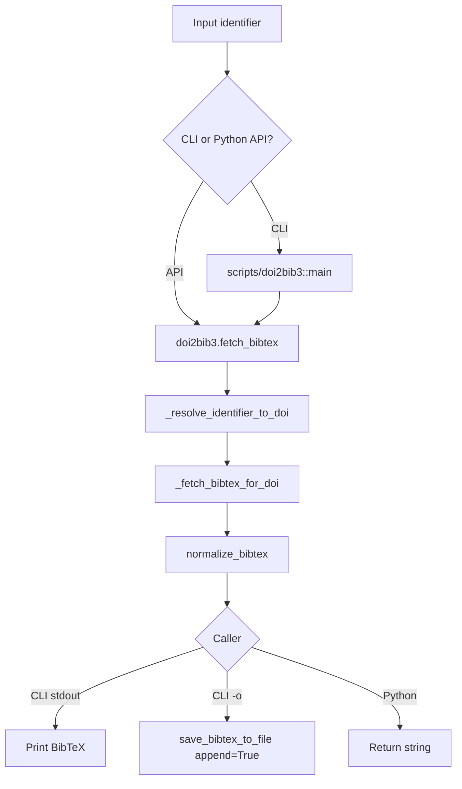
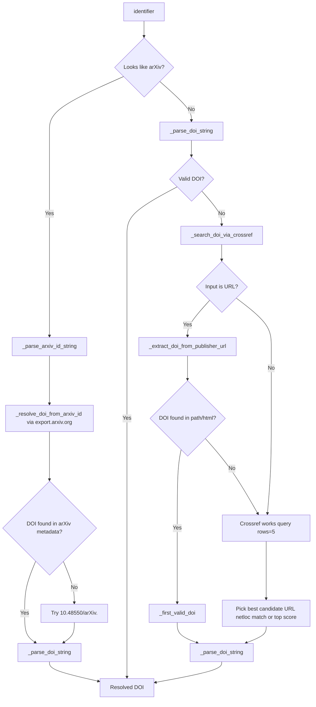
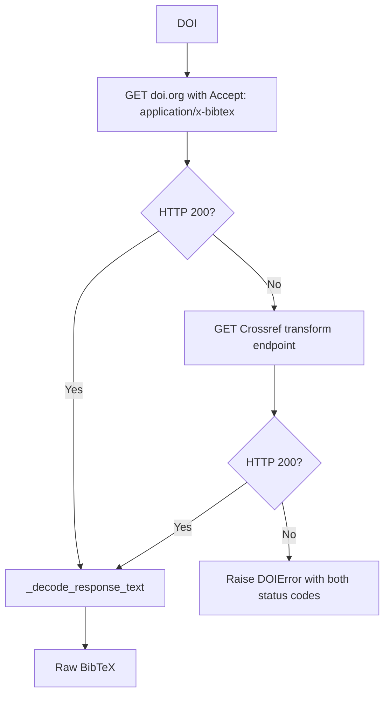
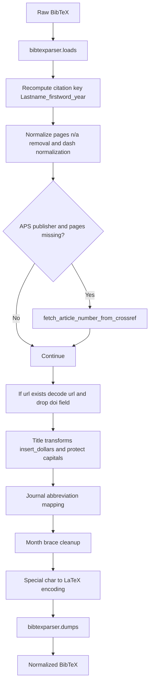

# doi2bib3 Algorithm Visuals

Simple visual diagrams for `docs/ALGORITHM.md`.

GitHub renders Mermaid blocks directly. If your editor does not, open this file on GitHub or paste blocks into https://mermaid.live.

## 1) End-to-End Flow

## 2) Identifier Resolution Decision Tree

## 3) DOI to BibTeX Fetch (with fallback)

## 4) Normalization Pipeline

## 5) Function Map (Quick Reference)

- CLI entry: `scripts/doi2bib3` -> `build_parser()`, `main()`
- Public API: `doi2bib3/backend.py` -> `fetch_bibtex()`
- Resolve identifier: `doi2bib3/backend.py` -> `_resolve_identifier_to_doi()`
- arXiv parse/query: `doi2bib3/backend.py` -> `_parse_arxiv_id_string()`, `_resolve_doi_from_arxiv_id()`
- Crossref search: `doi2bib3/backend.py` -> `_search_doi_via_crossref()`
- URL DOI extraction: `doi2bib3/backend.py` -> `_extract_doi_from_publisher_url()`
- Fetch raw BibTeX: `doi2bib3/backend.py` -> `_fetch_bibtex_for_doi()`
- Normalize BibTeX: `doi2bib3/normalize.py` -> `normalize_bibtex()`
- Write output file: `doi2bib3/io.py` -> `save_bibtex_to_file()`
