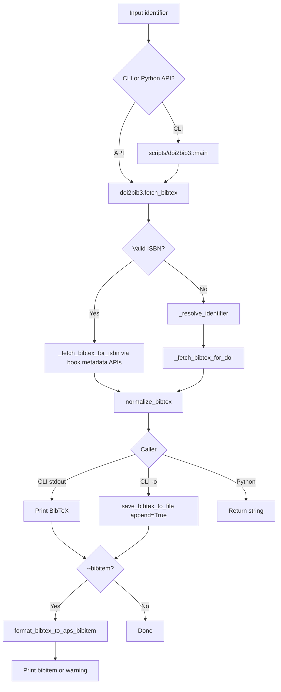
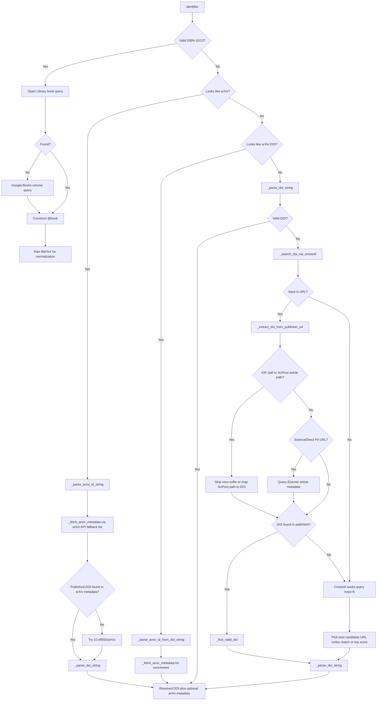
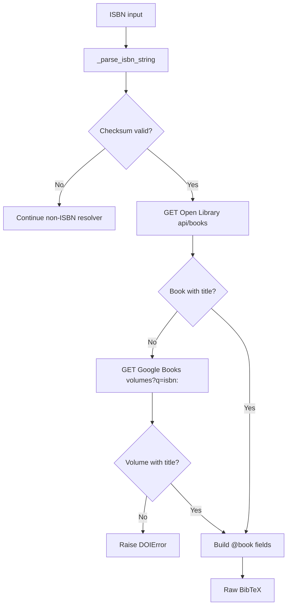
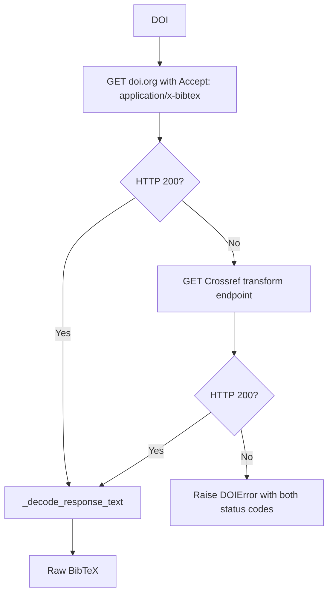
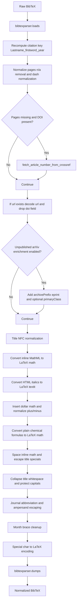

# doi2bib3 Algorithm Visuals

Simple visual diagrams for `docs/ALGORITHM.md`.

## 1) End-to-End Flow

## 2) Identifier Resolution Decision Tree

## 3) ISBN to BibTeX Fetch

## 4) DOI to BibTeX Fetch (with fallback)

## 5) Normalization Pipeline

## 6) Function Map (Quick Reference)

- CLI entry: `scripts/doi2bib3` -> `build_parser()`, `main()`
- Public API: `doi2bib3/backend.py` -> `fetch_bibtex()`
- ISBN parse/query: `doi2bib3/backend.py` -> `_parse_isbn_string()`, `_fetch_bibtex_for_isbn()`
- Resolve identifier: `doi2bib3/backend.py` -> `_resolve_identifier()`, `_resolve_identifier_to_doi()`
- arXiv parse/query: `doi2bib3/backend.py` -> `_parse_arxiv_id_string()`, `_parse_arxiv_id_from_doi_string()`, `_fetch_arxiv_metadata()`, `_resolve_arxiv_identifier()`
- Crossref search: `doi2bib3/backend.py` -> `_search_doi_via_crossref()`
- URL DOI extraction: `doi2bib3/backend.py` -> `_extract_doi_from_publisher_url()`, `_extract_doi_from_sciencedirect_url()`
- Fetch raw BibTeX: `doi2bib3/backend.py` -> `_fetch_bibtex_for_doi()`
- Normalize BibTeX: `doi2bib3/normalize.py` -> `normalize_bibtex()`
- Format APS/RevTeX bibitem: `doi2bib3/bibitem.py` -> `format_bibtex_to_aps_bibitem()`
- Write output file: `doi2bib3/io.py` -> `save_bibtex_to_file()`
